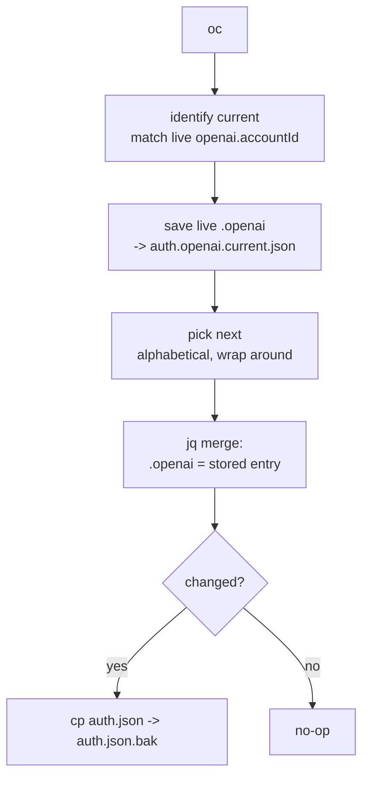

# zim-opencode

> Zsh tooling for [opencode](https://opencode.ai).

Three concerns live in this repo:

- **[`auth.zsh`](auth.zsh)** — rotate one provider's account in opencode's `auth.json` across multiple identities (default: OpenAI). *Active; sourced on shell load.*
- **[`init.zsh`](init.zsh)** — generate and cache zsh completions for the `opencode` binary, and put `bin/` on `PATH`. *Zimfw-style; dormant unless loaded via `zmodule`.*
- **[`bin/opencode-ls.sh`](bin/opencode-ls.sh)** — list opencode processes running in tmux panes (target + pid + cwd), filterable by session/window. *Bash; on `PATH` via `init.zsh`.*

## `auth.zsh` — provider-scoped account rotation

### Commands

| command | action |
|---|---|
| `oc` | rotate to the next account (alphabetical), saving the current one first |
| `oc <name>` | switch to a specific account (handle or unique prefix) |
| `ocLs` | list accounts for the active provider; `*` marks current, shows id + token expiry |
| `ocImport` | seed the store from legacy `auth.json.<name>` snapshots and de-symlink `auth.json` |
| `ocProvider <provider> [account]` | print a provider's entry as JSON, from the live file or a stored account |

### Data model — rotate one provider entry

`auth.json` holds credentials for several providers (opencode, openrouter, zai, cerebras, **openai**). Only the rotating provider's entry differs across accounts, so we store **just that entry** and swap it in place — the other providers stay put in the live file:

```
~/.local/share/opencode/
  auth.json                       # live file opencode reads (all providers)
  auth.openai.openai1.json        # just the openai object for account "openai1"
  auth.openai.openai2.json
```

A switch is a `jq` merge — `.openai = <stored entry>` — never a whole-file replace.

### Identity — stable accountId, not the rotating token

`openai.accountId` is a stable UUID that does **not** change when access/refresh tokens rotate, so current-account detection is a direct match of the live `accountId` against the store. No marker file, no fallback needed. The access token is itself a JWT whose `https://api.openai.com/profile` claim carries the account **email**, so human-friendly naming (instead of positional labels like `openai1`/`openai2`) is recoverable when wanted.

### Why copy, not symlink

Same reason as [`zim-claude`](../zim-claude/README.md): opencode rewrites `auth.json` atomically, which orphans a symlinked backing file. We write a real file (via `jq` merge), so the live `auth.json` is always a plain file.

### Safety

- `auth.json` → `auth.json.bak` before any changed overwrite.
- Save-before-switch copies the outgoing account's live entry back to its store file; a trailing ` *` marks a captured refresh.
- Warns if `opencode` is running, since it may rewrite `auth.json` on exit.

### Switch flow



### Parameterization

Provider and identity field are env vars with defaults, so the same code targets any provider without code changes:

| var | default | meaning |
|---|---|---|
| `OPENCODE_PROVIDER` | `openai` | which provider entry to rotate |
| `OPENCODE_ID_FIELD` | `accountId` | stable id field within that provider |
| `OPENCODE_DIR` | `~/.local/share/opencode` | store / live-file location |
| `OPENCODE_AUTH` | `$OPENCODE_DIR/auth.json` | the live auth file |

Observation is stateless: current account is derived only from `auth.json` + the available `auth.<provider>.*.json` files, plus the env var above — no bespoke config.

## `init.zsh` — opencode completions

Loads on module import and, if `opencode` is in `$PATH`, writes yargs-based zsh completions to `functions/_opencode` whenever they are missing or older than the `opencode` binary. Install as a zimfw module:

```zsh
# ~/.zimrc
zmodule rektide/zim-opencode
```

## `bin/opencode-ls.sh` — find opencode processes in tmux

Lists opencode processes running inside tmux panes — one row per match: the tmux target (`session:window.pane`, ready for `tmux kill-pane`), pid, and cwd (which project). Sorted by target. Filter by session substring, and optionally an exact window:

```sh
opencode-ls.sh                       # all
opencode-ls.sh comp                  # sessions whose name contains "comp"
opencode-ls.sh compfuzor 6           # + exact window number
OPENCODE_LS_PROC=node opencode-ls.sh # match a different process name
```

A window filter requires a session substring. Kill a row with `kill <pid>` (or `kill -9` if hung), or `tmux kill-pane -t <target>`. Bash, not zsh-specific; `init.zsh` puts `bin/` on `PATH` in zsh shells — symlink into `~/.local/bin` if you want it in bash too.

## Wiring

`auth.zsh` is sourced via `~/.config/zsh/conf.d/zim-opencode-auth.conf` (symlink), auto-sourced by the user `conf.d` loop. `init.zsh` follows the zimfw `zmodule` convention above.
